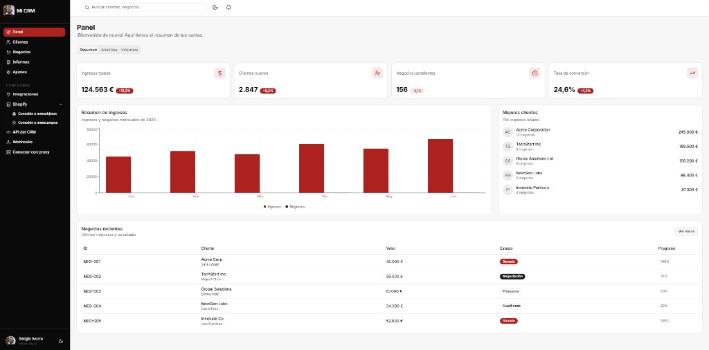

# Plantilla CRM — ES — FREE

Plantilla **CRM gratuita en español** para arrancar tu propio panel de clientes, ventas e integraciones.

Tema **rojo + negro**, lista para personalizar y publicar.

[](https://nextjs.org)
[](https://www.typescriptlang.org/)
[](https://tailwindcss.com)
[](./LICENSE)
[](#)
[](#)

---

## Vista previa



> Panel con métricas, gráfico de ingresos, mejores clientes, negocios recientes e integraciones (Shopify, API, webhooks y proxy).

---

## ¿Para qué sirve?

Una base lista para:

- montar un **CRM interno** o demo comercial
- enseñar un dashboard moderno a clientes
- conectar **Shopify** (metaobjetos / metacampos), **API**, **webhooks** y **proxy**
- personalizar branding (logo, colores, textos)

---

## Características

| Área | Qué incluye |
|------|-------------|
| **Panel** | Ingresos, clientes nuevos, negocios pendientes, conversión |
| **Clientes** | Ranking de mejores clientes por ingresos |
| **Negocios** | Tabla con estado, valor y progreso |
| **Informes** | Gráficos de ingresos mensuales |
| **Integraciones** | Hub de conexiones |
| **Shopify** | Desplegable → metaobjetos y metacampos |
| **API del CRM** | Endpoints y claves (demo) |
| **Webhooks** | Eventos listos para activar |
| **Proxy** | Formulario de conexión a proxy |
| **UI** | Responsive, modo claro/oscuro, menú lateral |

---

## Stack técnico

- **Next.js 16** (App Router)
- **React 19** + **TypeScript**
- **Tailwind CSS v4**
- **shadcn/ui** + **Recharts** + **Lucide**

---

## Cómo empezar

### Requisitos

- Node.js **18+**
- npm / yarn / pnpm / bun

### Instalación

```bash
git clone https://github.com/SERGIOIVORRA/Plantilla-CRM---ES---FREE-PARA-EMPEZAR-TU-CRM-.git
cd Plantilla-CRM---ES---FREE-PARA-EMPEZAR-TU-CRM-

npm install
npm run dev
```

Abre **[http://localhost:3000](http://localhost:3000)** en el navegador.

### Scripts

| Comando | Descripción |
|---------|-------------|
| `npm run dev` | Servidor de desarrollo |
| `npm run build` | Build de producción |
| `npm start` | Arranca el build |
| `npm run lint` | Linter |

---

## Estructura del proyecto

```
├── public/
│   ├── logo.png          # Logo / avatar
│   └── preview.png       # Captura para el README
├── src/
│   ├── app/
│   │   ├── favicon.ico   # Favicon (tu marca)
│   │   ├── icon.png
│   │   ├── apple-icon.png
│   │   ├── globals.css   # Tema rojo (#AD221F) + negro
│   │   ├── layout.tsx
│   │   └── page.tsx      # Dashboard + apartados
│   ├── components/ui/    # Componentes shadcn
│   └── lib/utils.ts
├── preview.png
├── LICENSE
└── README.md
```

---

## Personalización rápida

1. **Logo / favicon** → sustituye `public/logo.png` y los iconos en `src/app/`
2. **Colores** → variables en `src/app/globals.css` (`--primary: #AD221F`)
3. **Textos** → todo en español en `src/app/page.tsx`
4. **Integraciones** → pantallas demo listas para cablear a tu backend

---

## Roadmap sugerido

- [ ] Conectar API real de Shopify (metaobjetos / metacampos)
- [ ] Autenticación de usuarios
- [ ] Persistencia en base de datos
- [ ] Webhooks firmados en producción
- [ ] Deploy en Vercel / tu hosting

---

## Autor

**Sergio Ivorra**

Plantilla gratuita para empezar tu CRM en español.

Repo: [SERGIOIVORRA/Plantilla-CRM---ES---FREE-PARA-EMPEZAR-TU-CRM-](https://github.com/SERGIOIVORRA/Plantilla-CRM---ES---FREE-PARA-EMPEZAR-TU-CRM-)

---

## Licencia

Distribuido bajo licencia **[MIT](./LICENSE)**.  
Úsala en proyectos personales o comerciales.
